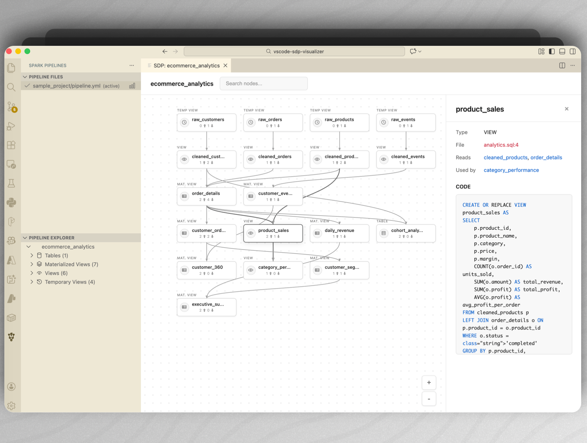

# Spark Pipeline Visualizer (DAG, YAML, SQL)

Visualize Apache Spark Declarative Pipelines as interactive DAGs directly in VS Code.

✔ Instantly understand complex Spark pipeline dependencies  
✔ Navigate tables, views, and transformations visually  
✔ Jump from DAG nodes to source code with one click  



---

## 🚀 Features

- Visualize pipeline DAGs from **Python, and SQL** files
- Interactive dependency graph for Spark declarative pipelines
- Click DAG nodes to open source code directly in the editor
- Preview SQL and Python snippets with syntax highlighting
- Dark mode 🥷
- Horizontal and vertival flow


---

## ⚡ Getting Started (30 seconds)

1. Open a workspace containing a Spark pipeline (`pipeline.yml`, `.py`, or `.sql`)
2. Click the **Spark Pipeline Visualizer** icon in the Activity Bar
3. Select a pipeline from the automatically detected files
4. Explore the pipeline DAG and entity details in the sidebar and webview

---

## 🧩 Supported Entity Definitions

The extension detects Spark entities defined using the `@dp.` or `@sdp.` decorator syntax in Python files.

Entities are identified by extracting the `name` parameter from the decorator and resolving dependencies from referenced SQL queries.

### Supported Decorators

| Decorator | Entity Type |
|----------|------------|
| `@dp.table(name="...")` | Table |
| `@dp.view(name="...")` | View |
| `@dp.materialized_view(name="...")` | Materialized View |
| `@dp.temporary_view(name="...")` | Temporary View |
| `@dp.streaming_table(name="...")` | Streaming Table |

### Example

```python
from pyspark.sql import SparkSession
from pyspark import pipelines as dp  # or sdp

@dp.materialized_view(name="sales_summary")
def create_sales_summary(spark: SparkSession):
    return spark.sql("""
        SELECT region, SUM(amount) AS total
        FROM raw_sales
        GROUP BY region
    """)

@dp.table(name="customers_enriched")
def enrich_customers(spark: SparkSession):
    return spark.sql("""
        SELECT c.*, o.order_count
        FROM raw_customers c
        LEFT JOIN order_counts o ON c.id = o.customer_id
    """)
