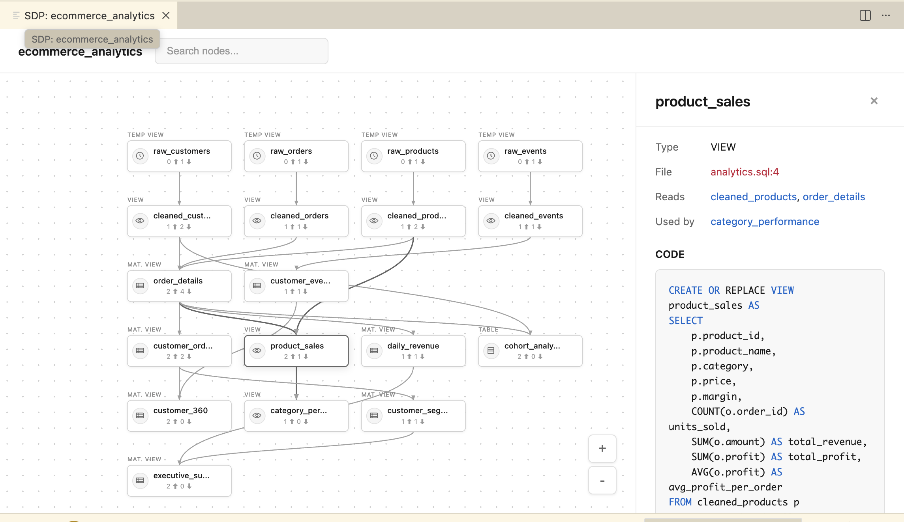

# UI for Spark Declarative Pipeline (SDP)

Visualize Apache Spark Declarative Pipelines - tables, views, materialized views, and their dependencies from PySpark and SQL definitions.

## Features

- 📊 **Visualize pipeline DAGs** from YAML, Python, and SQL files
- 🔗 **Click nodes** to open source code directly in editor
- 👁️ **Preview code snippets** with syntax highlighting in sidebar
- 🔄 **Live updates** on file save

## Installation

### From VS Code Marketplace

1. Search for "**UI for Spark Declarative Pipeline**" in the Extensions view
2. Click **Install**

Or install directly: [Install Extension](vscode:extension/gszecsenyi.sdp-pipeline-visualizer)

### From VSIX

1. Download the latest `.vsix` file from the releases
2. In VS Code, run `Extensions: Install from VSIX...` and select the file

## Usage

1. Open a workspace containing a `pipeline.yml`, Python, or SQL pipeline file
2. Click the **SDP Pipeline Visualizer** icon in the Activity Bar
3. Select a pipeline from the automatically listed files in the sidebar
4. View the pipeline DAG and entity details in the sidebar and webview

## Developer

Developed by **Gergely Szécsényi**

## License

BSD 2-Clause License — see [LICENSE](LICENSE) for details.
