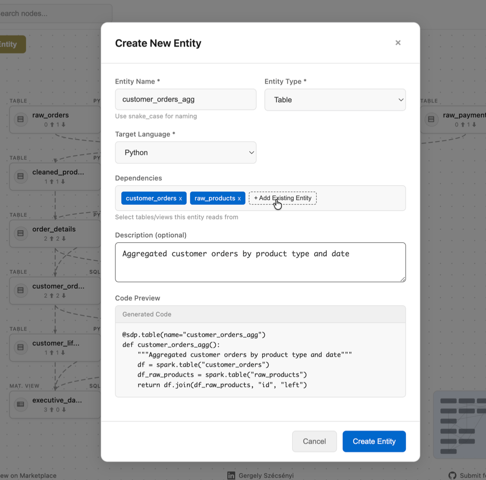

# Spark Pipeline Designer -- Build Spark Declarative Pipelines in VS Code

**Go from idea to running pipeline in minutes.** SDP Designer is a low-code, click-based pipeline builder for Apache Spark Declarative Pipelines, right inside VS Code.

No boilerplate. No hassle. Just open VS Code, point at your project, and start building.



---

## Why SDP Designer?

What started as a simple DAG visualizer has evolved into a full pipeline designer. Whether you're a data engineer, analyst, or just getting started with declarative pipelines, Designer lets you:

- **Build pipelines visually** -- create tables, views, and streaming tables with a few clicks
- **Generate boilerplate automatically** -- Python and SQL source files are created for you
- **Preview code before finalizing** -- see exactly what gets generated before committing
- **Work offline with Databricks** -- edit your project locally, sync back via Git when you're online
- **Navigate instantly** -- click any node in the DAG to jump to its source code

---

## Getting Started

1. Install the extension from the VS Code Marketplace
2. Open a workspace containing a Spark pipeline (`.yml`, `.py`, or `.sql` files)
3. Click the **SDP Designer** icon in the Activity Bar
4. Select a pipeline from the auto-detected files
5. Start building -- add entities, define dependencies, and preview your pipeline

That's it. You can have a working pipeline in under 10 minutes.

---

## Features

### Visual Pipeline Designer

Create new pipeline entities directly from the graph. Pick a name, choose the entity type, select dependencies, and Designer generates the source file and places it in the right directory.

### Interactive DAG Visualization

Explore your pipeline as an interactive dependency graph with full support for horizontal and vertical layouts, dark and light themes, search, and node navigation.

### Full Python and SQL Support

Designer understands both PySpark decorators and SQL DDL statements. Mix and match languages in the same pipeline -- Designer handles the dependency resolution across both.

### Databricks Compatible

Designer recognizes Databricks declarations (`@dlt.*`, `@dp.*`, `@sdp.*`). Work on your Databricks project offline in VS Code using Git synchronization, then push your changes when you're back online.

### Smart Code Generation

Generated code follows your project structure. Target folders are resolved from your pipeline YAML `libraries` globs, so new files land exactly where they belong.

---

## Supported Entity Types

| Type | Python Decorator | SQL Statement |
|------|-----------------|---------------|
| Table | `@dp.table(name="...")` | `CREATE TABLE ...` |
| View | `@dp.view(name="...")` | `CREATE VIEW ...` |
| Materialized View | `@dp.materialized_view(name="...")` | `CREATE MATERIALIZED VIEW ...` |
| Temporary View | `@dp.temporary_view(name="...")` | -- |
| Streaming Table | `@dp.streaming_table(name="...")` | -- |

Decorators from `@dlt.*`, `@dp.*`, and `@sdp.*` namespaces are all supported.

---

## Example

```python
from pyspark.sql import SparkSession
from pyspark import pipelines as dp

@dp.materialized_view(name="sales_summary")
def create_sales_summary(spark: SparkSession):
    return spark.sql("""
        SELECT region, SUM(amount) AS total
        FROM raw_sales
        GROUP BY region
    """)

@dp.table(name="customers_enriched")
def enrich_customers(spark: SparkSession):
    return spark.sql("""
        SELECT c.*, o.order_count
        FROM raw_customers c
        LEFT JOIN order_counts o ON c.id = o.customer_id
    """)
```

---

## Validation

Before creating an entity, Designer checks:

- **Name** -- must be a valid identifier, not a SQL reserved word, and unique in the pipeline
- **Dependencies** -- warns about references to entities that don't exist yet
- **Circular dependencies** -- rejects additions that would create a cycle in the DAG
- **Schema** -- validates field names and types when provided

---

## Roadmap

- Unity Catalog integration
- Run and dry-run support on Apache Spark and Databricks servers
- And more -- check the [GitHub repo](https://github.com/gszecsenyi/vscode-sdp-visualizer-extension) for ideas and discussion

---

## Contributing

This is an open-source hobby project. Contributions, ideas, and feedback are welcome on [GitHub](https://github.com/gszecsenyi/vscode-sdp-visualizer-extension).

---

**[Install from VS Code Marketplace](https://marketplace.visualstudio.com/items?itemName=gszecsenyi.sdp-pipeline-visualizer)**
